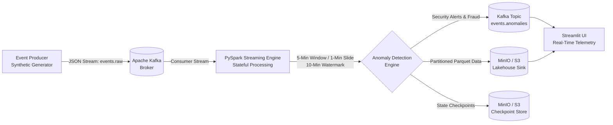

# Real-Time Clickstream & Anomaly Detection Pipeline

An end-to-end distributed stream processing pipeline engineered with **Apache Kafka**, **PySpark Structured Streaming**, and **S3 / MinIO**. The system ingests high-throughput user interaction clickstreams, executes sliding-window aggregations with late-data watermarking, identifies security and financial anomalies in real time, and persists partitioned Parquet datasets with fault-tolerant checkpointing.

---

## Architecture Overview



### Data Pipeline Flow
1. **Ingestion Layer**: Multi-threaded event generator simulates user interaction clickstreams (logins, product views, checkouts, transactions) and streams structured JSON payloads to Kafka topic `events.raw`.
2. **Stream Processing Layer**: PySpark Structured Streaming ingests the stream, enforces explicit schema parsing, and registers an event-time watermark.
3. **Stateful Window Aggregation**: A 5-minute sliding window with a 1-minute slide evaluates rolling metrics across user IDs and IP addresses.
4. **Watermarking & Late Arrivals**: A 10-minute watermarking threshold (`.withWatermark("event_time", "10 minutes")`) allows the engine to gracefully handle out-of-order and delayed network logs without memory leaks.
5. **Multi-Pattern Anomaly Rules**:
   - **Credential Stuffing / Brute Force**: Detects $\ge 5$ failed login attempts within a 5-minute window per IP/User.
   - **Transaction Velocity Spikes**: Flags rapid transactions ($\ge 3$ transactions or cumulative amount $\ge \$10,000$) in a window.
   - **Bot / Scraper Bursts**: Identifies abnormal request rates ($\ge 100$ page views per window per IP).
6. **Dual-Sink Persistence**:
   - High-priority security alerts emitted back to Kafka topic `events.anomalies`.
   - Raw and anomaly datasets written to S3/MinIO in snappy-compressed, partitioned Parquet format.
   - Persistent checkpointing prevents data loss during cluster recovery.
7. **Telemetry & Visual Monitoring**: Interactive Streamlit dashboard connects directly to Kafka and S3 to provide real-time KPI metrics, threat feeds, and geographical distribution of offending traffic.

---

## Repository Structure

```
.
├── .github/
│   └── workflows/
│       └── ci.yml                # Automated linting and test execution
├── config/
│   ├── spark_config.yaml         # Spark streaming, watermark, and storage parameters
│   └── producer_config.yaml      # Event generation rates, ratios, and anomaly injection
├── docker/
│   ├── docker-compose.yml        # Multi-service stack (Kafka, Zookeeper, MinIO, UI, Dashboard)
│   ├── Dockerfile.spark          # PySpark streaming container with S3A & Kafka JARs
│   ├── Dockerfile.producer       # Standalone event producer container
│   └── Dockerfile.dashboard      # Real-time Streamlit dashboard container
├── src/
│   ├── common/
│   │   ├── config.py             # YAML and environment variable configuration loader
│   │   ├── logging_utils.py      # Standardized structured logging
│   │   └── schemas.py            # PySpark StructType schemas & Pydantic models
│   ├── producer/
│   │   ├── event_generator.py    # Clickstream simulator and anomaly scenario generator
│   │   └── kafka_producer.py     # Kafka publisher service with automated retry backoff
│   ├── streaming/
│   │   ├── anomaly_detector.py   # Window aggregations and anomaly detection logic
│   │   ├── sinks.py              # S3 Parquet, Kafka anomaly, and console sink connectors
│   │   └── spark_stream_job.py   # Main PySpark streaming driver application
│   └── dashboard/
│       └── app.py                # Streamlit real-time monitoring and visualization UI
├── tests/
│   ├── test_schemas.py           # Schema parsing and validation unit tests
│   ├── test_generator.py         # Event generation and anomaly burst tests
│   └── test_anomaly_detector.py  # PySpark window aggregation and rule logic unit tests
├── scripts/
│   ├── setup_minio.py            # Bucket initialization and verification script
│   ├── run_local.sh              # Local environment startup helper (Bash)
│   ├── run_local.ps1             # Local environment startup helper (PowerShell)
│   └── produce_events.sh         # Standalone event generator execution script
├── Makefile                      # Standard development and deployment tasks
├── pyproject.toml                # Project packaging and metadata
├── requirements.txt              # Production dependencies
└── requirements-dev.txt          # Development, testing, and linting dependencies
```

---

## Technical Specifications

| Component | Technology | Version | Purpose |
| :--- | :--- | :--- | :--- |
| **Message Broker** | Apache Kafka | 7.6.1 (Confluent) | High-throughput distributed event log |
| **Stream Engine** | Apache Spark (PySpark) | 3.5.1 | Stateful sliding window stream processing |
| **Object Storage** | MinIO / AWS S3 | Release 2024+ | Parquet lakehouse sink & checkpoint store |
| **Data Format** | Apache Parquet | Snappy compressed | Columnar storage partitioned by action & date |
| **Storage Connector**| Hadoop AWS (S3A) | 3.3.4 | Direct S3A connector for Spark storage writes |
| **UI Telemetry** | Streamlit + Plotly | 1.36.0 | Real-time monitoring of anomalies & throughput |

---

## Quickstart Guide

### Prerequisites
- Docker & Docker Compose
- Python 3.10+ (for local development)
- Java JDK 11 or 17 (if running Spark natively outside Docker)

### Option 1: One-Command Docker Compose Deployment

Clone the repository and spin up the complete distributed stack:

```bash
git clone https://github.com/dianatofficial/Real-time-Clickstream-Anomaly-Detection.git
cd Real-time-Clickstream-Anomaly-Detection

# Launch all services (Kafka, Zookeeper, MinIO, Producer, PySpark, Dashboard)
make up
```

Once running, access the web consoles:
- **Streamlit Telemetry Dashboard**: [http://localhost:8501](http://localhost:8501)
- **Kafka UI Console**: [http://localhost:8080](http://localhost:8080)
- **MinIO S3 Storage Console**: [http://localhost:9001](http://localhost:9001) *(User: `minioadmin` / Pass: `minioadmin`)*

To stop all services:
```bash
make down
```

---

### Option 2: Local Native Execution

If you prefer to run services natively or against existing Kafka/S3 infrastructure:

1. **Install Dependencies**:
   ```bash
   python -m venv venv
   source venv/bin/activate  # On Windows: .\venv\Scripts\activate
   pip install -r requirements.txt
   pip install -r requirements-dev.txt
   ```

2. **Start Infrastructure Only**:
   ```bash
   docker compose -f docker/docker-compose.yml up -d zookeeper kafka kafka-ui minio create-buckets
   ```

3. **Run the Synthetic Producer**:
   ```bash
   python src/producer/kafka_producer.py
   ```

4. **Submit the PySpark Streaming Job**:
   ```bash
   spark-submit \
     --packages org.apache.spark:spark-sql-kafka-0-10_2.12:3.5.1,org.apache.hadoop:hadoop-aws:3.3.4,com.amazonaws:aws-java-sdk-bundle:1.12.262 \
     src/streaming/spark_stream_job.py
   ```

5. **Start the Telemetry Dashboard**:
   ```bash
   streamlit run src/dashboard/app.py
   ```

---

## Anomaly Detection Logic & Rules

The stream processor computes rolling window states and evaluates the following conditions:

```python
# Credential Stuffing / Brute Force Detection
window_spec = window(col("event_time"), "5 minutes", "1 minute")
failed_logins = (
    parsed_df.filter(col("action") == "login_failed")
    .groupBy(window_spec, col("ip_address"), col("user_id"))
    .agg(count(lit(1)).alias("failed_login_count"))
    .filter(col("failed_login_count") >= 5)
)

# Transaction Velocity Spike
transactions = (
    parsed_df.filter(col("action") == "transaction_success")
    .groupBy(window_spec, col("user_id"), col("ip_address"))
    .agg(
        count(lit(1)).alias("txn_count"),
        sum(col("amount")).alias("cumulative_amount")
    )
    .filter((col("txn_count") >= 3) | (col("cumulative_amount") >= 10000.0))
)
```

---

## Testing & Quality Assurance

Run the automated test suite with code coverage:

```bash
# Run pytest with coverage
pytest -v tests/

# Run static analysis and linting
flake8 src tests
black --check src tests
isort --check-only src tests
```

---

## Production Deployment Architecture

For enterprise cloud environments, this pipeline maps directly to managed cloud services:

- **AWS**: Amazon MSK (Managed Kafka) + AWS EMR / AWS Glue Streaming + Amazon S3 + Amazon Athena / QuickSight.
- **GCP**: Google Cloud Pub/Sub (or Confluent Cloud on GCP) + Dataproc Serverless / Dataflow + Google Cloud Storage (GCS) + BigQuery.
- **Kubernetes**: Strimzi Kafka Operator + Spark on Kubernetes (Spark Operator) + Ceph / MinIO S3 object store.

---

## Resume Highlights

- **Bullet Point**:
  > "Engineered an end-to-end event-driven streaming pipeline leveraging Apache Kafka and PySpark Structured Streaming, handling sliding window aggregations and late-arriving events via watermarking with stateful fault-tolerant checkpoints."

---

## License

This project is licensed under the MIT License - see the [LICENSE](LICENSE) file for details.
